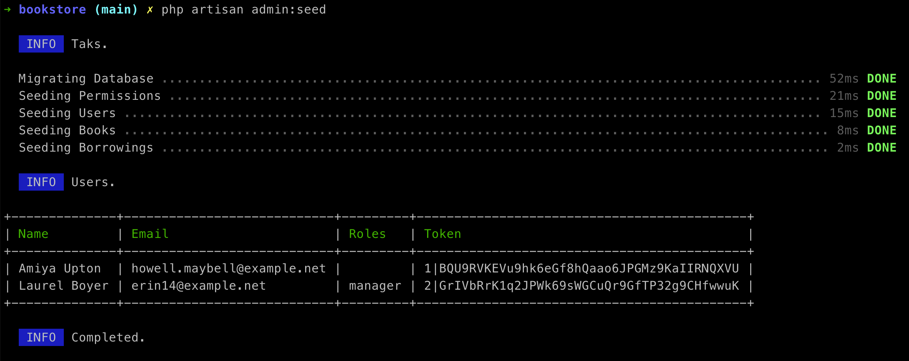

#Bookstore API

The purpose of this API is to provide a simplified and straightforward interface. It follows a minimalist approach without the use of Docker or complex database systems. Instead, it leverages the capabilities offered by the underlying framework.

## How to use

- `git clone https://github.com/maurobaptista/bookstore.git`
- `cd bookstore`
- `composer install`
- `php artisan key:generate`
- `php artisan admin:seed`



## Endpoints

### GET /api/access

Tests if the provided credentials are correct and valid.

On success (Status 200):
```
[
    'message' => 'success'
]
```

Curl:
```
curl -X GET \
-H "Authorization: Bearer YOUR_API_TOKEN" \
-H "Accepts: application/json" \
http://127.0.0.1:8000/api/access
```
### GET /api/books

Retrieves a JSON array containing all existing books.

On success (Status 200):
```
[
  0 => [
    "id" => 1
    "title" => "I, Robot"
    "description" => "I, Robot** description"
    "publisher" => "Spectra"
    "author" => "Isaac Asimov"
    "cover_photo" => "https://sample.com/irobot.jpg"
    "price" => 2999
    "is_available" => true
  ], [
    "id" => 2
    "title" => "Rendezvous with Rama"
    "description" => "Rendezvous with Rama description"
    "publisher" => "RosettaBooks"
    "author" => "Arthur C. Clarke"
    "cover_photo" => "https://sample.com/rama.jpg"
    "price" => 1850
    "is_available" => false
  ]
]
```

### GET /api/books/{id}

Retrieves the JSON data of an existing book based on its ID.

On success (Status 200):
```
[
    "id" => 1
    "title" => "I, Robot"
    "description" => "I, Robot description"
    "publisher" => "Spectra"
    "author" => "Isaac Asimov"
    "cover_photo" => "https://sample.com/irobot.jpg"
    "price" => 2999
    "is_available" => true
]
```

### POST /api/books

Adds a new book to the collection.

Rules:

| Field | Required | Validation |
|---|:---:|---|
| title | yes | min:2, max:256 |
| description | no | min:10, max:2048 |
| publisher | no | min:2, max:256 |
| author | no | min:2, max:256 |
| cover_photo | no  | url |
| price | yes | integer, min:0, max:999999 |

On success (Status 201):
```
[
    "id" => 1
    "title" => "I, Robot"
    "description" => "I, Robot description"
    "publisher" => "Spectra"
    "author" => "Isaac Asimov"
    "cover_photo" => "https://sample.com/irobot.jpg"
    "price" => 2999
    "is_available" => true
]
```

### PUT /api/books/{id}

Updates the information of an existing book based on its ID.

Rules:

| Field | Required | Validation |
|---|:---:|---|
| title | yes | min:2, max:256 |
| description | no | min:10, max:2048 |
| publisher | no | min:2, max:256 |
| author | no | min:2, max:256 |
| cover_photo | no  | url |
| price | yes | integer, min:0, max:999999 |

On success (Status 200):
```
[
    "id" => 1
    "title" => "I, Robot"
    "description" => "I, Robot description"
    "publisher" => "Spectra"
    "author" => "Isaac Asimov"
    "cover_photo" => "https://sample.com/irobot.jpg"
    "price" => 2999
    "is_available" => true
]
```

### DELETE /api/books/{id}

Deletes an existing book from the collection based on its ID.

On success (Status 204):
```
[]
```

### GET /api/books/borrow

Retrieves a JSON array containing all the books currently borrowed by the logged user.

On success (Status 200):
```
[
  0 => [
    "id" => 1
    "title" => "I, Robot"
    "description" => "I, Robot description"
    "publisher" => "Spectra"
    "author" => "Isaac Asimov"
    "cover_photo" => "https://sample.com/irobot.jpg"
    "price" => 2999
    "is_available" => false
  ], [
    "id" => 2
    "title" => "Rendezvous with Rama"
    "description" => "Rendezvous with Rama description"
    "publisher" => "RosettaBooks"
    "author" => "Arthur C. Clarke"
    "cover_photo" => "https://sample.com/rama.jpg"
    "price" => 1850
    "is_available" => false
  ]
]
```

### POST /api/books/{id}/borrow

Borrows a book and associates it with the logged user.

On success (Status 201):
```
[]
```

### DELETE /api/books/{id}/borrow

Borrows a book and associates it with the logged user.

On success (Status 204):
```
[]
```

## Tests
`php artisan test`
